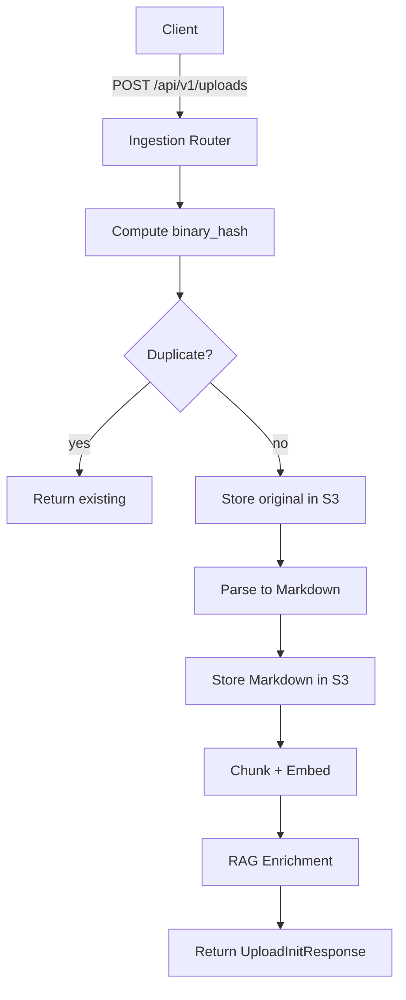
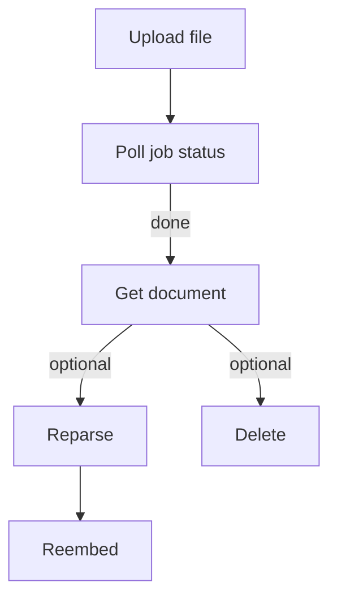

# API overview

This page documents the FastAPI endpoints exposed by VecAPI. All endpoints are under the base prefix `/api`.

- Versioned endpoints: `/api/v1/...`

Diagram — Request flow (upload)

<details>
<summary>Show request flow (upload)</summary>



</details>

## Health

`GET /health`

Returns service status.

Example

```bash
curl -s http://localhost:8000/health
```

Response

```json
{"status": "ok"}
```

## Uploads

`POST /api/v1/uploads`

Upload a document for ingestion. Computes a stable binary hash first, checks for duplicates, stores the original file to S3, parses to Markdown, stores Markdown, chunks and embeds, then runs metadata enrichment.

Parameters

- `file` (form-data file): Document to upload (PDF, DOCX, etc.)
- `hints_json` (form-data string, optional): JSON string matching `UploadHints` to influence parsing/routing.
- `Idempotency-Key` (header, optional): Idempotency key; injected into hints if not set.

Example request and response

```bash
curl -s -X POST \
  -H 'Idempotency-Key: 4c1e2bfb-0c69-4a5c-8f2b-1f2b10dbdaaa' \
  -F 'file=@tests/test_data/sample.pdf' \
  -F 'hints_json={"collection":"financials","source":"acme","profile":"default"}' \
  http://localhost:8000/api/v1/uploads
```

Response (200)

```json
{
  "job_id": "job_123",
  "document_id": "doc_abc",
  "duplicate": false,
  "message": "Queued for processing"
}
```


## Jobs

`GET /api/v1/jobs/{job_id}`

Get the status of an ingestion job by ID.

Example

```bash
curl -s http://localhost:8000/api/v1/jobs/job_123
```

`PATCH /api/v1/jobs/{job_id}/review`

Submit a human review for an ingestion job to correct or approve extracted metadata.

Example

```bash
curl -s -X PATCH \
  -H 'Content-Type: application/json' \
  -d '{"approved": true, "corrections": {"company_name":"Acme Inc."}}' \
  http://localhost:8000/api/v1/jobs/job_123/review
```


## Documents

`GET /api/v1/documents/{document_id}`

Retrieve a single document by its ID.

`GET /api/v1/documents`

List documents with optional filters and pagination.

Query params

- `company_id`, `doc_type`, `reporting_year`, `scope`, `status`, `q`
- `page_token` (opaque), `page_size` (1-200)

Example

```bash
curl -s 'http://localhost:8000/api/v1/documents?company_id=acme&reporting_year=2024&page_size=20'
```

`POST /api/v1/documents/{document_id}/reparse`

Re-run parsing for an existing document with optional overrides.

`POST /api/v1/documents/{document_id}/reembed`

Re-compute embeddings for an existing document's chunks, replacing previous vectors.

`DELETE /api/v1/documents/{document_id}`

Delete a document and its associated vectors and artifacts.

## Profiles

`GET /api/v1/profiles`

List available processing profiles and their capabilities.

!!! warning
    Always compute `binary_hash` before any storage and skip duplicates.

## How to use the routes in practice

This section shows an end-to-end, practical flow with recommendations for idempotency, polling, and safe retries.

Diagram — Typical lifecycle: upload → poll → fetch → (optional) reparse/reembed → delete



### 1) Upload with idempotency

Use an Idempotency-Key header and provide hints for routing.

```bash
curl -s -X POST \
  -H 'Idempotency-Key: 00000000-0000-4000-8000-000000000001' \
  -F 'file=@tests/test_data/sample.pdf' \
  -F 'hints_json={"collection":"financials","source":"acme/2024/10-K","profile":"default"}' \
  http://localhost:8000/api/v1/uploads
```

Notes

- The service computes `binary_hash` before any storage to de-duplicate uploads.
- If a duplicate is detected for the same collection, the response will indicate it and return the existing `document_id`.
- You can safely retry the exact same request with the same Idempotency-Key.

### 2) Poll job status until completion

```bash
JOB_ID=job_123
until curl -s "http://localhost:8000/api/v1/jobs/$JOB_ID" | jq -e '.status=="succeeded" or .status=="failed"'; do
  sleep 1
done
```

Recommendations

- Use exponential backoff (1s, 2s, 4s…) to reduce load.
- Treat `failed` as terminal; inspect `message`/`errors` if present.

### 3) Fetch the document record

```bash
doc_id="doc_abc"
curl -s "http://localhost:8000/api/v1/documents/$doc_id"
```

- This record should include references to S3 artifacts (original + markdown) and enriched metadata.
- To find recent documents, use the list endpoint with filters:

```bash
curl -s 'http://localhost:8000/api/v1/documents?company_id=acme&reporting_year=2024&page_size=20'
```

### 4) Optional maintenance: reparse or reembed

Reparse (e.g., after parser improvements or hint updates):

```bash
curl -s -X POST \
  -H 'Content-Type: application/json' \
  -d '{"force": true, "parser_overrides": {"ocr": false}}' \
  http://localhost:8000/api/v1/documents/$doc_id/reparse
```

Reembed (e.g., after model upgrade or new chunking rules):

```bash
curl -s -X POST \
  -H 'Content-Type: application/json' \
  -d '{"model": "text-embedding-3-large", "replace": true}' \
  http://localhost:8000/api/v1/documents/$doc_id/reembed
```

### 5) Delete when needed

```bash
curl -s -X DELETE -i "http://localhost:8000/api/v1/documents/$doc_id"
```

### Best practices

- Idempotency
  - Always send `Idempotency-Key` on uploads to make retries safe.
  - The backend also prevents duplicates via `binary_hash`.
- Correlation IDs
  - Send `X-Correlation-Id` with a UUID on every request for traceability in logs.
- Pagination
  - Prefer `page_size` between 20–100. Use returned `page_token` for the next page.
- Timeouts and retries
  - Client timeouts of 30–60s for upload are reasonable; use shorter timeouts for polling.
- Error handling
  - Errors are returned as JSON: `{code, message, correlation_id}`. Log `correlation_id` for support.

### Related docs

- [Ingestion](ingestion.md) — pipeline, hash policy, and S3 storage.
- [RAG](rag.md) — document-info agent and validation.
