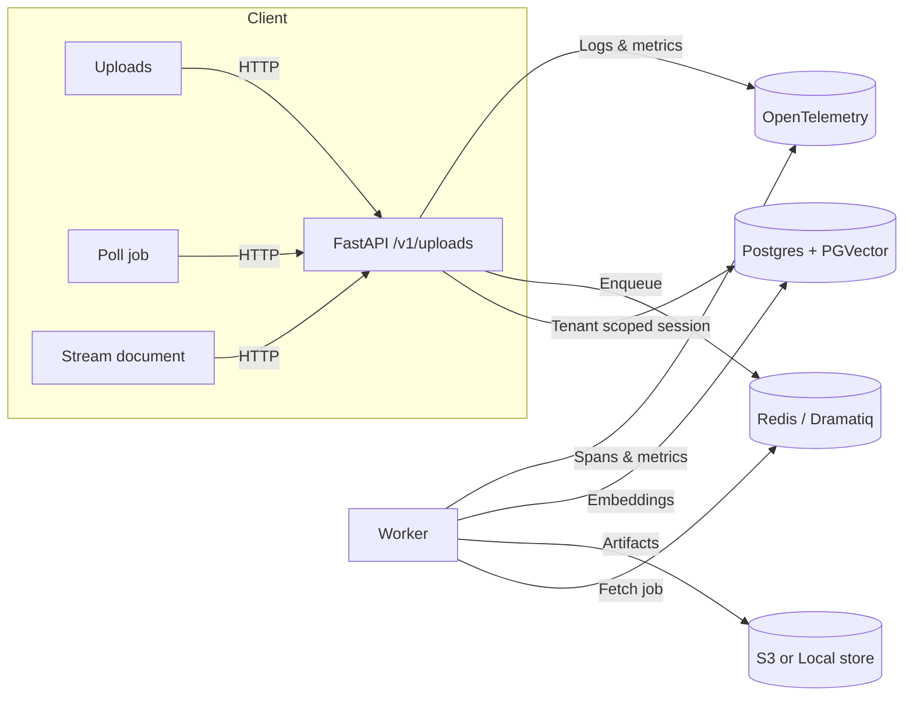

# System Architecture

VecAPI is an asynchronous FastAPI backend that ingests unstructured files, normalises them, and produces vectorised knowledge bases for downstream RAG agents. The runtime is split into a web tier that handles HTTP traffic and a Dramatiq worker tier that performs CPU- and network-heavy processing. Both tiers share Postgres (with PGVector) and object storage.

## High-Level Components

- **API service (`src/main.py`, `src/api/`)** — exposes authenticated `/v1` endpoints for uploads, document metadata, streaming originals/Markdown, and job polling. Dependencies inject tenant-scoped sessions so every request runs inside row-level security boundaries.
- **Service layer (`src/services/`)** — orchestrates domain workflows. `UploadService` coordinates hashing, dedupe, job management, and the asynchronous pipeline. `DocumentService` and `JobService` encapsulate persistence and business rules for their respective aggregates.
- **Repositories (`src/repositories/`)** — thin SQLModel wrappers that persist rich domain types (documents, jobs, ingestions) and hide SQL from service logic. They enforce uniqueness and convert database rows into typed schemas.
- **Object store adapters (`src/store/`)** — fulfil the `StoreProtocol` for `s3://` or local filesystem URIs. Storage providers are selected at runtime via `store.providers.default_store_provider`.
- **Vector stack (`src/vector/`)** — embeds parsed chunks with LangChain’s `PGVector` integration. `DocumentIngestor` batches documents, enriches metadata, and records ingestion fingerprints for idempotency.
- **Monitoring (`src/monitoring/`)** — provides middleware, metrics instruments, and alerting hooks shared by the worker and API.
- **Worker runtime (`src/worker/`)** — Dramatiq actors consume upload jobs, execute the `UploadPipeline`, send OpenTelemetry spans, and emit liveness heartbeats to Redis.

## Runtime Responsibilities

| Layer | Responsibilities | Key Modules |
| --- | --- | --- |
| Edge (`/v1` routes) | Request validation, authentication via access context, translating domain errors into HTTP responses. | `src/api/v1/upload_routes.py`, `src/api/v1/document_routes.py`, `src/api/v1/job_routes.py`, `src/api/v1/streaming_routes.py` |
| Services | Orchestrate multi-step workflows, enforce dedupe, progress updates, and repository invariants. | `src/services/upload_service.py`, `src/services/upload_steps.py`, `src/services/document_service.py`, `src/services/job_service.py` |
| Persistence | Encapsulate SQLModel sessions, build queries, handle conflict retries, and return typed DTOs. | `src/repositories/*` |
| Worker | Execute ingestion pipeline, manage heartbeats, emit OpenTelemetry spans/metrics, and send alerts on failure. | `src/worker/actors.py`, `src/worker/broker.py`, `src/monitoring/middleware.py` |
| Vector | Provide embeddings providers, batching, ingestion fingerprints, and PGVector configuration. | `src/vector/factory.py`, `src/vector/ingestor.py`, `src/vector/batching.py` |
| Storage | Persist originals/Markdown, generate URIs, manage S3 prefixes, or mirror to the local filesystem. | `src/store/s3_store.py`, `src/store/local_store.py`, `src/store/providers.py` |

## Tenancy and Access Context

- All HTTP routes depend on `AccessContext` headers (tenant id, user id, role) to scope SQLModel sessions via `tenauth`.
- The session factory attaches `app.tenant_id` and search path hints, enabling Postgres RLS and schema isolation.
- Vector store connections inherit the same tenant id; PGVector writes and reads only within the caller’s schema.
- Artifacts stored in S3/local include the collection name and document UUID, preventing cross-tenant collisions.

## Data Stores & External Dependencies

| Dependency | Purpose | Notes |
| --- | --- | --- |
| Postgres + PGVector | Canonical metadata (`documents`, `jobs`, `ingestions`) and high-dimensional embeddings. | Requires extensions `pgvector` and optional row-level security policies. |
| Redis | Dramatiq broker, optional worker heartbeat tracking. | Leave `DRAMATIQ_BROKER_URL` unset to run inline for tests. |
| S3 bucket or filesystem | Original files and Markdown snapshots. | `StoreProtocol` abstracts the backend; URIs are persisted on documents. |
| OpenAI / embeddings provider | Default embeddings model (`text-embedding-3-small`) or custom provider. | Configure via `OPENAI_API_KEY` and `Settings.embedding`. |
| LlamaParse / Docling | Parser integrations controlled by processing profiles. | `LLAMA_CLOUD__API_KEY` and extras enable advanced parsing. |

## Request Lifecycle

1. FastAPI dependency stack authenticates the request and binds a tenant-aware SQLModel session.
2. Uploads call `UploadService.initiate_document_intake`, which hashes the file, detects duplicates, and enqueues a Dramatiq job.
3. The worker’s `process_upload` actor rehydrates `ContinueProcessingInput`, rebuilds the `UploadService`, and steps through `UploadPipeline`:
   - Store the original artifact.
   - Parse into LangChain `Document` objects + Markdown.
   - Persist Markdown.
   - Batch, embed, and write vectors.
   - Update document URIs and mark the job completed.
4. Job and document repositories update progress so clients can poll `/v1/jobs/{id}` or stream files when ready.

## Extensibility Points

- **Processing profiles** (future-facing) determine parser choice, embedding config, and collection metadata.
- **Parser implementations** can be swapped by overriding `UploadPipeline.parse_document` or injecting a custom parser in `services.factory.get_upload_service`.
- **Embeddings providers** can be swapped by injecting custom instances into `vector.factory.get_vectorstore`.
- **Store providers** allow extending beyond S3/local implementations.

With these seams, VecAPI can target different storage backends, embeddings models, or parsing strategies without reworking the core pipeline.
