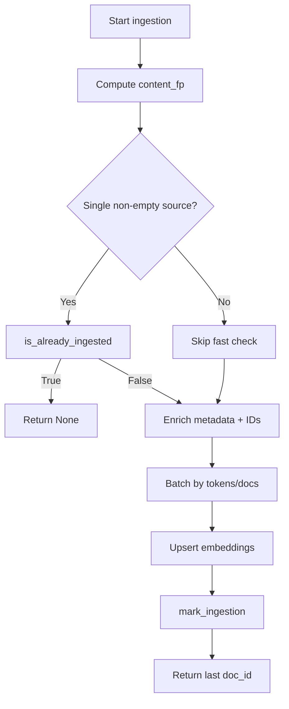

# DocumentIngestor

Module: `vectorstore.ingestor`

DocumentIngestor orchestrates vectorstore ingestion of already-parsed, normalized Document chunks. It performs:

- Validation of input documents (content + source metadata)
- Batching by estimated token count and max docs per batch
- Deterministic ID generation and metadata enrichment per chunk
- Idempotency checks via an ingestion ledger (content_fp + settings tuple)
- Deletion helpers by source or doc_id
- Metadata updates, including convenience updates for extracted DocInfo


## Key concepts

| Concept             | Description                                                                                  |
|---------------------|----------------------------------------------------------------------------------------------|
| content_fp          | sha256 over normalized text content, used when original binary hash is unavailable.          |
| Deterministic IDs   | Derived from source \| content_fp \| chunk_id via _prepare_metadata.                          |
| Ingestion ledger    | ingestion_versions table records (collection, source, content_fp, chunker_version, embed_model, embed_model_ver, doc_id) to enable fast-skip for duplicates. |


## Settings

Uses `vectorstore.models.IngestorSettings` (Pydantic model):

- chunker_version: str — semantic version of the chunking strategy.
- model_name: str — embedding model identifier.
- embed_model_ver: str — embedding model version/tag.
- max_tokens_per_request: int — soft limit for a batch’s total estimated tokens.
- max_docs_per_batch: int — maximum documents per batch.


## Public API summary

### Ingestion

- ingest — Validate + batch documents, enrich metadata, generate deterministic IDs, and upsert into the vectorstore.
- estimate_tokens — Estimate token usage consistent with batching.
- plan_batches — Compute batch plan using the same rules as ingestion.

### Deletion

- delete_by_source — Delete embeddings for all chunks by source.
- delete_by_doc_id — Delete all embeddings for a specific doc_id.

### Validation & Planning

- validate_docs — Filter invalid docs and collect human-readable errors.

### Metadata Updates

- update_metadata — Merge arbitrary metadata into cmetadata for all chunks belonging to the source.
- update_doc_info — Store extracted company, financial_year, and document_type.


## Quick Reference

| Method            | Purpose                                                                                  | Returns              |
|-------------------|------------------------------------------------------------------------------------------|----------------------|
| ingest            | Validate and batch documents, enrich metadata, generate IDs, and upsert embeddings.      | str or None          |
| delete_by_source  | Delete embeddings for all chunks by source.                                              | None                 |
| delete_by_doc_id  | Delete all embeddings for a specific doc_id.                                             | None                 |
| validate_docs     | Filter invalid documents and collect human-readable errors.                              | tuple[list[Document], list[str]] |
| estimate_tokens   | Estimate token usage consistent with batching.                                           | int                  |
| plan_batches      | Compute batch plan using the same rules as ingestion.                                   | list[list[Document]] |
| update_metadata   | Merge arbitrary metadata into cmetadata for all chunks belonging to the source.          | None                 |
| update_doc_info   | Store extracted company, financial_year, and document_type.                              | None                 |


### ingest
`ingest(docs: list[Document]) -> str | None  [async]`

Validate + batch documents, enrich metadata, generate deterministic IDs, and upsert into the vectorstore.

Returns the last batch’s doc_id, or None if ingestion was skipped (idempotency fast-skip).

<details>
<summary>Example</summary>

```python
last_doc_id = await ingestor.ingest(valid_docs)
# e.g. "acme/2024/10-K|b7d...|v1"
```
</details>


### delete_by_source
`delete_by_source(source: str) -> None  [async]`

Delete embeddings for all chunks by source.

<details>
<summary>Example</summary>

```python
await ingestor.delete_by_source("acme/2024/10-K")
```
</details>


### delete_by_doc_id
`delete_by_doc_id(doc_id: str) -> None  [async]`

Delete all embeddings for a specific doc_id.

<details>
<summary>Example</summary>

```python
await ingestor.delete_by_doc_id("acme/2024/10-K|b7d...|v1")
```
</details>


### validate_docs
`validate_docs(docs: list[Document]) -> tuple[list[Document], list[str]]`

Filter invalid docs and collect human-readable errors.

<details>
<summary>Example</summary>

```python
valid, errors = ingestor.validate_docs([
    Document(page_content="", metadata={"source": "acme/2024/10-K"}),
    Document(page_content="Body", metadata={}),
    Document(page_content="OK", metadata={"source": "acme/2024/10-K"}),
])
print(valid)
# => [Document(page_content='OK', metadata={'source': 'acme/2024/10-K'})]
print(errors)
# => [
#   'Doc[0]: empty page_content',
#   "Doc[1]: missing metadata['source']"
# ]
```
</details>


### estimate_tokens
`estimate_tokens(docs: list[Document]) -> int`

Estimate token usage consistent with batching.

<details>
<summary>Example</summary>

```python
estimated = ingestor.estimate_tokens(valid)
# => 42
```
</details>


### plan_batches
`plan_batches(docs: list[Document]) -> list[list[Document]]`

Compute batch plan using the same rules as ingestion.

<details>
<summary>Example</summary>

```python
plan = ingestor.plan_batches(valid)
# => [[doc0, doc1, ...], [docN, ...]]
```
</details>


### update_metadata
`update_metadata(source: str, metadata: dict[str, Any]) -> None  [async]`

Merge arbitrary metadata into cmetadata for all chunks belonging to the source.

<details>
<summary>Example</summary>

```python
await ingestor.update_metadata("acme/2024/10-K", {"section": "MD&A"})
```
</details>


### update_doc_info
`update_doc_info(source: str, doc_info: extract.models.DocInfo) -> None  [async]`

Store extracted company, financial_year, and document_type.

<details>
<summary>Example</summary>

```python
from extract.models import DocInfo
await ingestor.update_doc_info(
    "acme/2024/10-K", DocInfo(company="ACME Inc.", financial_year=2024, document_type="10-K")
)
```
</details>


## Idempotency flow

1) Compute content_fp over normalized text (compute_source_fingerprint).

2) If all documents share a single non-empty metadata['source'], call is_already_ingested to check the ledger with the current settings.

3) If already ingested, skip work and return None.

4) Otherwise, enrich metadata and add_documents in batches, then mark_ingestion with the computed fingerprint and returned doc_id.


Diagram — Ingestor idempotency flow
<details>
<summary>Show idempotency flow diagram</summary>



</details>

## Batching rules

- No batch exceeds settings.max_tokens_per_request by estimated tokens.
- No batch contains more than settings.max_docs_per_batch documents.
- Any single document exceeding the token limit is skipped with a warning.


## Usage example

<details>
<summary>Full example</summary>

```python
import asyncio
from langchain_core.documents import Document
from vector.models import IngestorSettings
from schemas.enums import CollectionEnum
from vector.ingestor import DocumentIngestor


async def main():
    settings = IngestorSettings(
        chunker_version="1.1.0",
        model_name="text-embedding-3-large",
        embed_model_ver="2025-06-01",
        max_tokens_per_request=4000,
        max_docs_per_batch=32,
    )

    ingestor = DocumentIngestor(CollectionEnum.DEFAULT, settings)

    docs = [
        Document(page_content="# Heading\nBody", metadata={"source": "acme/2024/10-K"}),
        Document(page_content="Another section", metadata={"source": "acme/2024/10-K"}),
    ]

    # Optional: pre-validate
    valid, errors = ingestor.validate_docs(docs)
    if errors:
        print("Invalid docs:", errors)

    # Estimate tokens and plan batches
    print("Estimated tokens:", ingestor.estimate_tokens(valid))
    plan = ingestor.plan_batches(valid)
    print("Batches:", [len(b) for b in plan])

    # Ingest (idempotent when same source + content_fp + settings)
    last_doc_id = await ingestor.ingest(valid)
    print("Ingested doc_id:", last_doc_id)

    # Update extracted info later (e.g., after RAG agent)
    from extract.models import DocInfo
    await ingestor.update_doc_info("acme/2024/10-K", DocInfo(
        company="ACME Inc.", financial_year=2024, document_type="10-K"
    ))

    # Deletion helpers
    await ingestor.delete_by_source("acme/2024/10-K")


if __name__ == "__main__":
    asyncio.run(main())
```
</details>


## Edge cases and examples

- Missing source metadata:
    - Behavior: `validate_docs` flags the document; `ingest` will skip invalid docs.
    - Example:
        ```python
        _, errors = ingestor.validate_docs([Document(page_content="Body", metadata={})])
        # => ["Doc[0]: missing metadata['source']"]
        ```

- Mixed sources in a single call:
    - Behavior: Ingestion still works, but fast idempotency check is disabled because a single shared source is required. Each chunk still gets deterministic IDs.

- Single document exceeding token limit:
    - Behavior: That document is skipped with a warning; other docs continue. `estimate_tokens` and `plan_batches` will reflect the skip.

- Re-running with the same settings and content:
    - Behavior: Ingestion fast-skips and returns None (idempotent).

- Re-running after changing `chunker_version` or embed model settings:
    - Behavior: Considered a new ingestion; content is reprocessed and a new doc_id is returned.

- Empty `page_content` or whitespace-only:
    - Behavior: `validate_docs` reports an error; doc is not ingested.

- Non-deterministic metadata fields:
    - Guidance: If you add timestamps or request IDs to metadata, keep them separate from the fields used for deterministic ID generation to preserve idempotency.


## Notes & best practices

- Always include metadata['source'] for each chunk; a single-source batch enables fast idempotency checks.
- Prefer computing and storing the true binary_hash upstream and include it in metadata for traceability. DocumentIngestor uses content_fp when binary hash is unavailable.
- Bind a correlation_id in your logs at call sites for better tracing with loguru.
- Keep chunker_version and embed model settings stable to benefit from idempotent re-runs; changes to these intentionally reprocess documents.
