# VecAPI Documentation

VecAPI is the ingestion and retrieval backend that powers Financials_RAG. It exposes a FastAPI service for uploads and read APIs, and coordinates background workers that normalize documents, persist artifacts, and embed content into a vector store.

## System Overview

- **FastAPI application (`app/`)** handles authenticated HTTP requests, orchestrates uploads, and exposes document metadata and streaming endpoints.
- **Background workers (`app/worker/`)** execute heavy processing (parsing, storage, embedding) via Dramatiq jobs triggered from uploads.
- **Persistence layer (`app/repositories/`)** wraps SQLModel repositories with domain-centric methods, isolating SQL from service logic.
- **Object storage (`app/store/`)** persists originals and derived Markdown artifacts to S3 (or pluggable stores for local development).
- **Vector pipeline (`app/vector/`)** batches parsed chunks, enriches metadata, and writes to the configured vector database.

```mermaid
flowchart LR
    A[Client Upload] --> B[FastAPI /uploads]
    B --> C[DocumentService.ensure_canonical_document]
    C --> D[JobService.init_job]
    D --> E[Dramatiq enqueue]
    E --> F[UploadPipeline.store_original]
    F --> G[UploadPipeline.parse_document]
    G --> H[UploadPipeline.store_markdown]
    H --> I[UploadPipeline.ingest_documents]
    I --> J[DocumentService.update_document_uris]
    J --> K[JobService.update_status -> completed]
```

## Key Capabilities

- **Idempotent uploads** — files are hashed before processing to deduplicate work across runs and tenants.
- **Pluggable parsing** — Docling, LlamaParse, and ChatDoc integrations are registered via parser providers; profiles choose the default.
- **Collection-scoped storage** — each processing profile maps to a collection name, allowing multi-tenant isolation.
- **Vector-ready ingestion** — metadata enrichment ensures every chunk carries a digest and deterministic chunk identifier.
- **Observability** — OpenTelemetry exporters and Loguru logging provide distributed tracing and structured logs end-to-end.

## Getting Started

1. Install dependencies with `uv sync`.
2. Start the API and worker with `scripts/run-dev.sh` (loads `.env` automatically).
3. Upload a document via `POST /v1/uploads` (see [`docs/api.md`](api.md)) and monitor job status through `GET /v1/jobs/{job_id}`.
4. Use the streaming endpoints to retrieve originals or normalized Markdown once the job completes.

Refer to the [Dev Guide](dev_guide.md) for parser configuration tips and the [Operations notes](operations/dramatiq.md) for worker deployment guidance.
