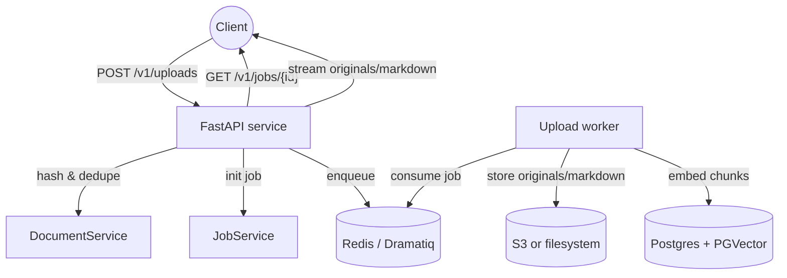

# VecAPI Documentation

VecAPI is the ingestion backend for Financials_RAG. It receives uploads through FastAPI, pushes heavy work to Dramatiq, stores canonical documents and artifacts, and writes embeddings into PGVector so downstream RAG agents can search enriched content.



## What Lives Where

- `src/main.py` — FastAPI entrypoint, logging, and OpenTelemetry initialisation.
- `src/api/v1/` — Upload, document, job, and streaming routes.
- `src/services/` — Upload orchestration, job lifecycle, document helpers, and pipeline steps.
- `src/repositories/` — SQLModel repositories for documents, jobs, and ingestion fingerprints.
- `src/store/` — Store providers (S3 and filesystem) implementing the artifact protocol.
- `src/vector/` — Batch chunking, embeddings, and PGVector integration.
- `src/worker/` — Dramatiq broker setup, actors, and heartbeat logic.

The documentation tree mirrors these responsibilities. Start with the [System Architecture](architecture.md) for a deep dive, then explore the API, operations, and reference guides as needed.

## Features at a Glance

- **Idempotent ingestion** — uploads are hashed; duplicate runs reuse existing jobs or skip embedding when fingerprints match.
- **Extensible parsing** — swap between LlamaParse, Docling, ChatDoc, or custom providers without touching pipeline code.
- **Multi-tenant aware** — access contexts scope SQLModel sessions, vector connections, and object storage prefixes.
- **Observability built-in** — OpenTelemetry spans, metrics, and Loguru logging for both the API and worker tiers.
- **Automation ready** — REST endpoints expose job lifecycle, document metadata, and streaming endpoints for downstream services.

## Quickstart

1. Install dependencies:

   ```bash
   uv sync
   ```

2. Populate `.env` with secrets (Postgres, Redis, OpenAI, S3). See [Configuration](configuration.md).
3. Launch API + worker:

   ```bash
   scripts/run-dev.sh
   ```

4. Upload a document via `POST /v1/uploads` (multipart). Track progress using `GET /v1/jobs/{job_id}` and download artifacts through the streaming routes.

Explore the [API Guide](api.md) for endpoint details, [Development Workflow](dev_guide.md) for coding conventions, and [Deployment](operations/deployment.md) for production readiness.
