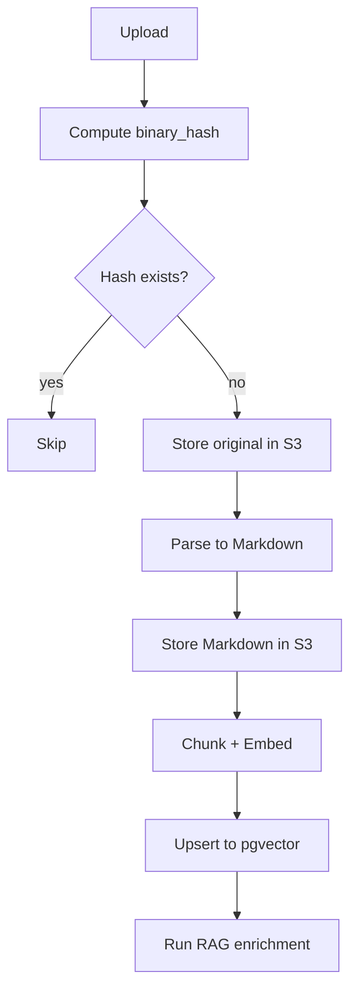

# Ingestion

Overview of the ingestion pipeline and hash policy.

- Compute `binary_hash` before any storage or embeddings.
- Store original and markdown copies in S3.
- Chunk by semantic sections; embed and upsert to pgvector.

Diagram — Idempotency flow

Show idempotency flow

