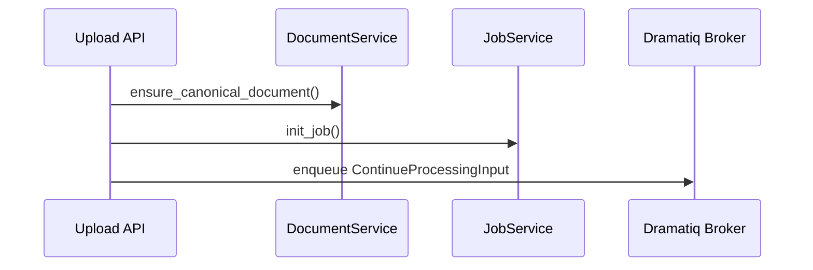
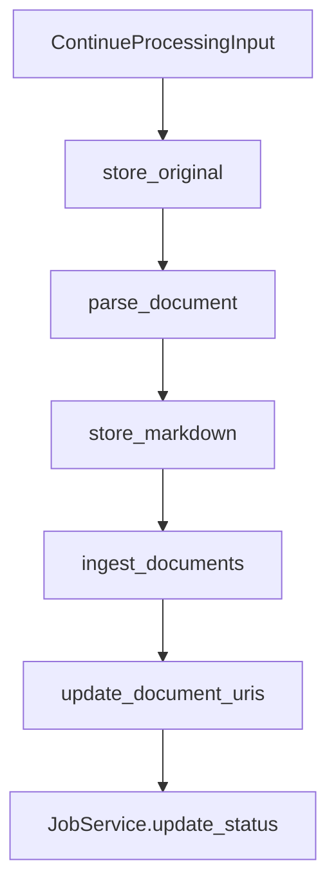

# Ingestion Pipeline

The ingestion pipeline turns uploads into vectorized documents while preserving traceability. It is assembled by `app/services/factory.py` and executed in two phases: synchronous request handling and asynchronous background work.

## Phase 1 — HTTP Request

1. `POST /v1/uploads` receives a `UploadFile`.
2. `UploadService.initiate_document_intake` hashes the file, ensures a canonical `DocumentRecord`, and initializes a `JobRecord`.
3. A `ContinueProcessingInput` payload is published to Dramatiq together with the tenant-aware `AccessContext`.

## Phase 2 — Background Processing

The worker picks up the job and executes the `UploadPipeline` steps in order:

1. **`store_original`** — uses the configured `StoreProtocol` (S3 by default) to upload the raw file and returns the storage key.
2. **`parse_document`** — runs the selected parser (Docling, LlamaParse, …) to produce LangChain `Document` objects and normalized Markdown.
3. **`store_markdown`** — uploads Markdown to object storage.
4. **`ingest_documents`** — batches parsed documents, enriches metadata (`digest`, `chunk_id`, `source`), and writes them into the vector store via `DocumentIngestor`.
5. **`update_document_uris`** — generates store-specific URIs and persists them to the `DocumentRecord`.
6. **`JobService.update_status`** — marks the job as `COMPLETED` or `FAILED`.

If any step raises an exception, `JobService.fail_job` captures the failure, persists the last successful step, and stops further processing.

## Idempotency & Deduplication

- Upload hashing ensures repeated files reuse the same `DocumentRecord`.
- `UploadService` checks `IngestionRepository` for an existing `IngestionVersion` fingerprint before re-ingesting vectors.
- Vector ingestion raises `EmbeddingsAlreadyExistError` when embeddings already exist for the digest and collection.

## Persistence Model

- **Documents** — `app/repositories/document_repo.py` stores canonical metadata, URIs, and job relationships.
- **Jobs** — `app/repositories/job_repo.py` tracks status, percent, and failure reasons.
- **Ingestions** — `app/repositories/ingestion_repo.py` records successful vector ingest runs, enforcing idempotency.

Refer to the [Upload Service reference](reference/upload_service.md) for method-level details.
