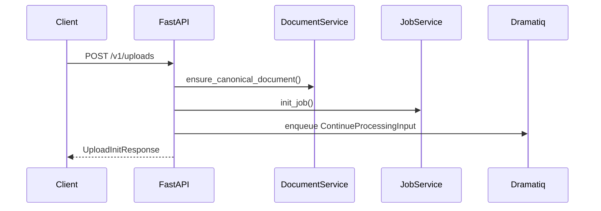
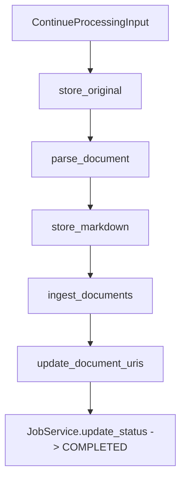

# Ingestion Pipeline

Uploads move through a two-phase pipeline that guarantees idempotency, tenant isolation, and traceability. `src/services/upload_service.UploadService` orchestrates both the synchronous HTTP work and the asynchronous background steps executed by the Dramatiq worker.

## Phase 1 — HTTP Request

1. `POST /v1/uploads` receives the file as `UploadFile`.
2. `UploadService.initiate_document_intake` hashes the file (`sha256_b64`), ensures a canonical `DocumentRecord`, and initialises or reuses a `JobRecord`.
3. A `ContinueProcessingInput` payload is enqueued on Dramatiq alongside the caller’s `AccessContext` so the worker continues with the same tenant scope.

## Phase 2 — Background Processing

The worker executes `UploadPipeline` (`src/services/upload_steps.py`) in sequence. Each step reports progress through `JobService.update_progress`.

| Step | Implementation | Description |
| --- | --- | --- |
| `store_original` | `StoreProtocol.save_original` | Streams the file into S3 or the filesystem, returning the storage key. |
| `parse_document` | `vector.parser.LlamaParser` (default) | Produces LangChain `Document` objects, normalises metadata, and renders Markdown. |
| `store_markdown` | `StoreProtocol.save_markdown` | Persists Markdown; warnings are logged if no Markdown is produced. |
| `ingest_documents` | `vector.ingestor.DocumentIngestor` | Batches documents, enriches metadata (`digest`, `chunk_id`), writes embeddings via PGVector, and records an ingestion fingerprint. |
| `update_document_uris` | `DocumentService.update_document_uris` | Generates URIs (`s3://` or `file://`) and persists them on the document. |

Any exception fails the job via `JobService.fail_job`, preserving the last successful step for diagnostics.

## Idempotency Guarantees

- **Digest reuse** — duplicate files resolve to the same `DocumentRecord` (`digest` + `collection`). Upload responses include `status=DUPLICATED` when embeddings already exist.
- **Ingestion fingerprints** — `IngestionRepository` stores `IngestionVersion` fingerprints based on collection + configuration. Replays skip embedding unless the fingerprint changes (e.g., new parser model).
- **Job reuse** — active jobs are reused; the API signals `already_running=true` when work is still in-flight.

## Storage & Metadata

- `DocumentService` persists canonical metadata, artifact URIs, and exposure flags.
- `JobService` handles lifecycle transitions (`QUEUED → PROCESSING → COMPLETED/FAILED`) and enforces monotonic progress.
- `StoreProtocol` implementations (`src/store/s3_store.py`, `src/store/local_store.py`) manage compression, MIME metadata, and URI generation.

For class-level documentation see:

- [UploadService](reference/upload_service.md)
- [DocumentIngestor](reference/document_ingestor.md)
- [IngestionRepository](reference/ingestion_repository.md)
