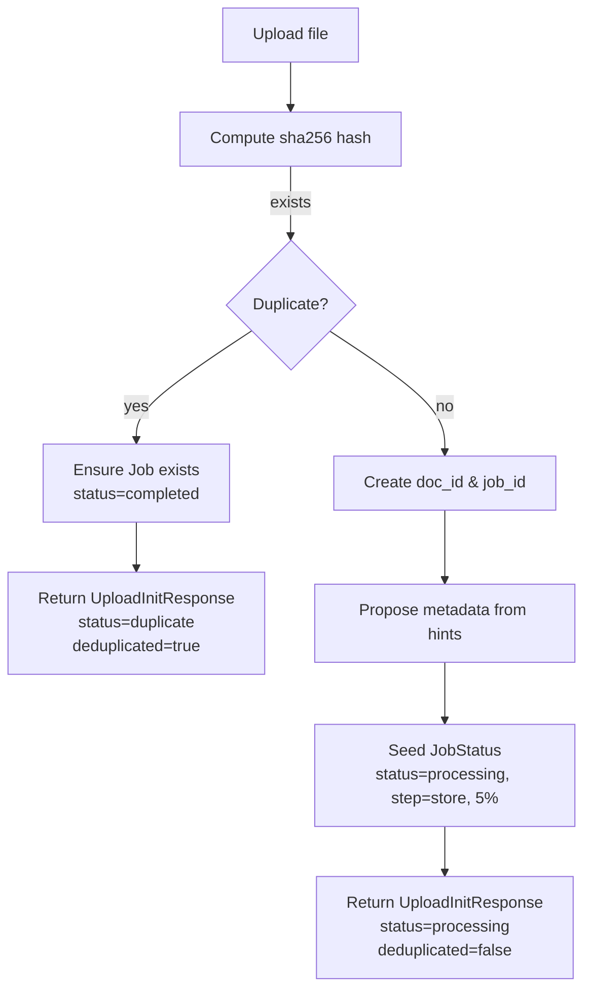

# Ingestion service

`IngestionService`

The IngestionService coordinates the initial upload and the light-weight, in-memory job lifecycle used by the API for testing and demos. It computes a stable binary hash, performs hash-based de-duplication, seeds a job with proposed metadata (if hints are provided), and exposes endpoints to poll status and review metadata.

Diagram — IngestionService flow


## Responsibilities

- Hash-first idempotency using `sha256` and in-memory maps.
- Deduplicate uploads by `binary_hash`; return existing `job_id` and `document_id`.
- Store a lightweight job record with progress and optional proposed metadata.
- Advance job progress on each status poll until completion.
- Apply review corrections and handle confirmation flow.

## Status conventions

- UploadInitResponse.status: `"queued" | "duplicate" | "processing"`
- JobStatusResponse.status: `"queued" | "processing" | "needs_review" | "completed" | "failed"`
- JobReviewResponse.status: `"processing" | "completed" | "needs_review"`

Important:
- Use the `deduplicated` flag to signal duplicate uploads; for duplicates, the job is ensured to be `completed` and the upload response uses `status="duplicate"`.
- For new uploads, the initial job uses `status="processing"` with `step="store"` at 5%.

## Idempotency and hash policy

- Always compute `binary_hash` before any storage or processing.
- If the hash already exists, return the same `document_id` and `job_id`.
- The service keeps only in-memory dictionaries for the scope of the running process; persistence is out of scope for this thin implementation.

## API usage snippets

- Initialize upload

```python
service = IngestionService()
resp = await service.process_document_upload(
    file_bytes=pdf_bytes,
    filename="annual_report.pdf",
    content_type="application/pdf",
    hints=UploadHints(company_hint="ACME AG", reporting_year_hint=2023),
)
# resp.status in {"processing", "duplicate"}
# resp.binary_hash == "sha256:..."
```

- Poll job status

```python
status = await service.get_job_status(resp.job_id)
# status.status in {"processing", "completed"}
```

- Review job

```python
import api.v1.job_routes

review = await api.v1.job_routes.review_job(
    resp.job_id,
    JobReviewPayload(confirm=True),
)
# review.status in {"processing", "completed", "needs_review"}
```

## Related pages

- [Ingestion](ingestion.md)
- [API](api.md)
- [Metadata repository](metadata_repository.md)
- [Document ingestor](document_ingestor.md)
