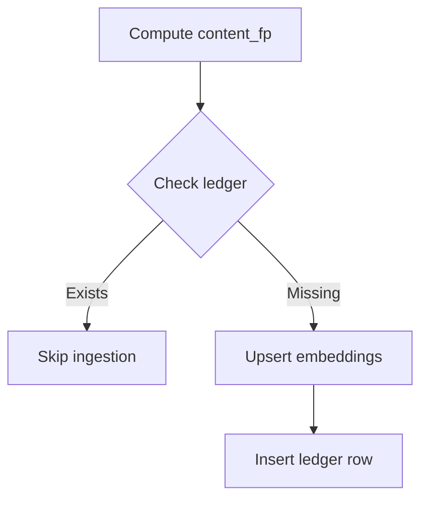

# MetadataRepository

Module: `core.db.repositories.metadata_repository`

MetadataRepository provides async data access to vectorstore-related metadata in Postgres. It centralizes queries and updates against the LangChain pgvector tables as well as a small ingestion ledger table used for idempotency checks.

- Depends on an initialized `DatabaseManager` for pooled async connections.
- Uses relative imports by policy (no absolute `app.*`).
- Designed for async-first usage within services like `vectorstore.ingestor.DocumentIngestor`.


## Responsibilities

- Query chunk text for a given source within a named collection (LangChain tables).
- Merge metadata fields into `cmetadata` for all chunks belonging to a source.
- Existence checks by source and collection.
- Maintain an idempotency ledger in `ingestion_versions` to support fast-skip re-runs.


## Tables and schema

This repository touches two areas:

1) LangChain pgvector tables (created by langchain/pgvector integration):
   - `langchain_pg_collection(uuid, name, ... )`
   - `langchain_pg_embedding(id, collection_id, document, cmetadata jsonb, ... )`

2) Ingestion ledger table managed here:

```sql
CREATE EXTENSION IF NOT EXISTS pgcrypto;
CREATE TABLE IF NOT EXISTS ingestion_versions (
  id               UUID PRIMARY KEY DEFAULT gen_random_uuid(),
  collection       TEXT NOT NULL,
  source           TEXT NOT NULL,
  content_fp       TEXT NOT NULL,
  chunker_version  TEXT NOT NULL,
  embed_model      TEXT NOT NULL,
  embed_model_ver  TEXT NOT NULL,
  created_at       TIMESTAMPTZ NOT NULL DEFAULT now(),
  UNIQUE (collection, source, content_fp, chunker_version, embed_model, embed_model_ver)
);
```

- Unique constraint enables idempotency fast-skip based on a tuple of settings and content fingerprint.
- Extension `pgcrypto` is ensured to enable `gen_random_uuid()`.


## Public API summary

| Method                         | Purpose                                                                                   | Returns |
|--------------------------------|-------------------------------------------------------------------------------------------|---------|
| ensure_ingestion_versions_table| Create the ingestion ledger table if missing.                                             | None    |
| get_document_chunks            | Return list of `document` texts for a given `source` within a `collection` name.         | list[str] |
| update_document_metadata       | Merge arbitrary fields into `cmetadata` for chunks of a `source` within a collection.     | None    |
| check_document_exists          | True if any chunk exists for `source` within a collection.                                | bool    |
| check_ingestion_version_exists | True if the unique ingestion tuple already exists (fast idempotency check).               | bool    |
| insert_ingestion_version       | Insert ingestion tuple; on conflict do nothing.                                           | None    |


## Method details

### get_document_chunks
`get_document_chunks(table_name: str, source: str) -> list[str]  [async]`

- `table_name` is the collection name stored in `langchain_pg_collection.name`.
- Returns chunk texts ordered by page number (if present) and stable by id.

Example:

```python
chunks = await repo.get_document_chunks("DEFAULT", "acme/2024/10-K")
```

### update_document_metadata
`update_document_metadata(table_name: str, source: str, metadata_updates: dict[str, Any]) -> None  [async]`

- Performs a JSONB merge: `cmetadata = cmetadata || $updates` for all chunks matching `source` within the named collection.
- No-op when `metadata_updates` is empty.

Example:

```python
await repo.update_document_metadata("DEFAULT", "acme/2024/10-K", {"section": "MD&A"})
```

### check_document_exists
`check_document_exists(table_name: str, source: str) -> bool  [async]`

- Returns True if any embedding row exists for the source in the named collection.

### ensure_ingestion_versions_table
`ensure_ingestion_versions_table() -> None  [async]`

- Creates the ledger table and required extension if not present.
- Called implicitly by other methods that rely on it.

### check_ingestion_version_exists
`check_ingestion_version_exists(*, collection: str, source: str, content_fp: str, chunker_version: str, embed_model: str, embed_model_ver: str) -> bool  [async]`

- Checks whether an ingestion with the given tuple has already been recorded.
- Safe to call on first run; ensures the table exists.

Example:

```python
already = await repo.exists_by_key(
    collection="DEFAULT",
    source="acme/2024/10-K",
    content_fp="b7d…",
    chunker_version="1.1.0",
    embed_model="text-embedding-3-large",
    embed_model_ver="2025-06-01",
)
```

### insert_ingestion_version
`insert_ingestion_version(*, collection: str, source: str, content_fp: str, chunker_version: str, embed_model: str, embed_model_ver: str, doc_id: str) -> None  [async]`

- Inserts the tuple; on conflict does nothing (idempotent).
- Note: current schema does not store `doc_id` as a column; it may be part of a higher-level record elsewhere. The parameter is accepted for API symmetry but not persisted in this table as implemented.


## How it fits in the pipeline

- DocumentIngestor computes a `content_fp` (fingerprint) over normalized content.
- Before upserting embeddings, it asks the repository whether the ingestion tuple already exists. If yes, ingestion can be skipped.
- After successful upsert, it records the tuple with `insert_ingestion_version` to enable fast-skip on subsequent runs.

Diagram — Idempotency ledger interaction
<details>
<summary>Show ledger flow</summary>



</details>

## Notes & best practices

- Always use collection-scoped queries to avoid cross-collection collisions.
- Prefer stable `source` identifiers like "{company}/{year}/{doctype}" to ease maintenance and deletes.
- Keep the tuple values stable across re-runs to benefit from idempotency. Changing `chunker_version` or embed model versions intentionally forces reprocessing.
- Bind a `correlation_id` in your logs at the call sites; mask sensitive data.


## Related documentation

- Ingestion orchestrator: [DocumentIngestor](document_ingestor.md)
- S3 storage: [S3DocumentStore](s3_document_store.md)
