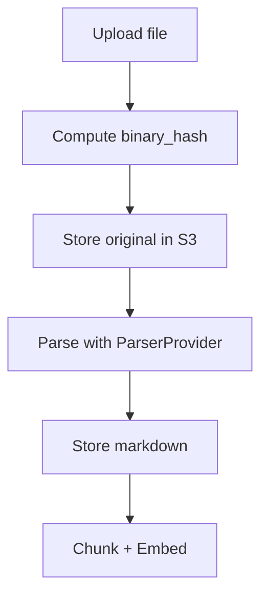

# Parsers

This page documents the base parser contract and the Docling-based implementation used in the ingestion pipeline.

- Async-first API: `parse()` returns structured `langchain` Documents; `to_markdown()` emits a normalized markdown copy.
- Configurable tokenization: parsers share a common `ParserConfig` with model-aware limits.
- Integration: the upload service orchestrates parsers and stores both the original file and a markdown copy in S3.

Diagram — Parser orchestration in upload


## Base parser

`class BaseParser(file_path: str, config: ParserConfig | None = None)`

The abstract base class defines common behavior and the contract for all parsers:

- Validates that `file_path` exists (raises `FileNotFoundError` if missing).
- Initializes a tokenizer using `tiktoken` (model-aware) via `docling_core`'s `OpenAITokenizer`.
- Abstract async method `parse()` must return a `ParseResult` containing a list of `langchain_core.documents.Document`.
- Async method `to_markdown()` is expected to be implemented by concrete parsers; base class raises `NotImplementedError`.

### Configuration

`class ParserConfig(BaseSettings)`

- `validate_on_init: bool = True` — when true, `__init__` validates that the file exists.
- `cache_results: bool = True` — recommended hint for implementations that cache parse results.
- `model_name: str = "gpt-4"` — tokenizer model name passed to `tiktoken.encoding_for_model`.
- `max_tokens: int = 128*1024` — tokenizer context window (used by chunkers).

### Usage example

```python
from app.parsers.base import BaseParser
from parsers.schemas import ParserConfig, ParseResult


class DummyParser(BaseParser):
    async def parse(self) -> ParseResult:
        from langchain_core.documents import Document
        docs = [Document(page_content="Hello", metadata={"page": 1})]
        return ParseResult(documents=docs)

    async def to_markdown(self) -> str:
        return "Hello\n"


parser = DummyParser("/path/to/file.pdf", ParserConfig(validate_on_init=False))
# await parser.parse(); await parser.to_markdown()
```

Edge cases

- Missing file
  - Behavior: `FileNotFoundError` during initialization (if `validate_on_init=True`).
- `to_markdown` not implemented
  - Behavior: `NotImplementedError` in the base class; implement in subclasses.

## Docling parser

`class DoclingParser(file_path: str, config: DoclingParserConfig | None = None)`

A concrete implementation that uses `langchain_docling.DoclingLoader` and `docling_core` chunking.

- Loader: `DoclingLoader(..., export_type=ExportType.DOC_CHUNKS, chunker=HybridChunker(tokenizer=self.tokenizer))`.
- Tokens: reuses `BaseParser` tokenizer; chunking respects `ParserConfig.max_tokens`.
- Caches parsed documents internally to support `to_markdown()` without re-loading.
- Metadata: each returned `Document` is annotated with `{"parser": "DoclingParser"}`.

### Methods

- `async parse() -> ParseResult`
  - Loads and chunks the document asynchronously via `loader.aload()`.
  - Returns `ParseResult(documents=[...])`.
  - Logs progress with `loguru`.
- `async to_markdown() -> str`
  - Requires a prior successful `parse()` call; raises `ValueError` otherwise.
  - Joins non-empty `page_content` blocks with double newlines.

### Usage example

```python
from app.parsers.docling import DoclingParser, DoclingParserConfig

parser = DoclingParser("tests/test_data/sample.pdf", DoclingParserConfig())
result = await parser.parse()
md = await parser.to_markdown()
print(len(result.documents), "chunks")
print(md[:200], "...")
```

### Integration points

- Upload pipeline step `parse_document` creates a parser via a `ParserProvider` and calls `parse()` then `to_markdown()`.
- The returned documents are sent to the ingestor; the markdown is stored to S3.
- See [Ingestion](ingestion.md) for the full flow and idempotency rules.

Edge cases

- Empty or unreadable content
  - Behavior: may return `documents=[]`; ingestion step should handle skipping embeds accordingly.
- Calling `to_markdown()` before `parse()`
  - Behavior: raises `ValueError` with guidance to call `parse()` first.
- Large documents exceeding token constraints
  - Behavior: chunking via `HybridChunker` will split using the configured tokenizer and `max_tokens`.
