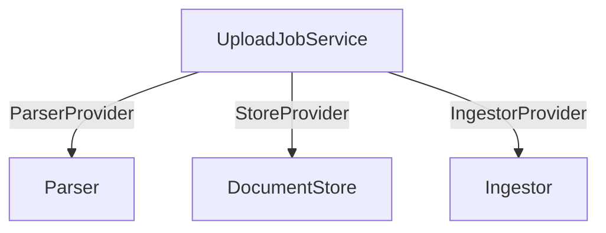

# Protocols and providers

`Parser`, `DocumentStore`, `Ingestor`, `ParserProvider`, `StoreProvider`, `IngestorProvider`

This backend uses a set of thin protocols and provider callables to keep the ingestion pipeline modular. You can swap implementations without changing the service logic.

## Overview

- Parser: turns a file on disk into structured `Document` chunks.
- DocumentStore: stores the original file and a markdown copy (S3-compatible).
- Ingestor: embeds and upserts documents into a vector store (pgvector).
- Providers: factories that create the above per-request with proper arguments.

Diagram — Provider wiring


## Protocols

### Parser
`async def parse(self) -> ParseResult`

- Input: configured by provider with `file_path`, `source`, optionally `profile`.
- Output: `ParseResult` with `documents: list[langchain_core.documents.Document]` and `source`.

Minimal skeleton

```python
from protocols.parsing import Parser
from parsers.schemas import ParseResult
from langchain_core.documents import Document


class MyParser(Parser):
    async def parse(self) -> ParseResult:
        # produce Document(page_content=...) and set source
        docs = [Document(page_content="Hello world")]
        return ParseResult(documents=docs, source="s3://bucket/key.pdf")
```

### DocumentStore
`async def save_original(self, path: str, *, document_id: str, content_type: str | None) -> StoredOriginal`

`async def save_markdown(self, markdown_text: str, *, document_id: str) -> None`

- `save_original` uploads the file at `path` and returns an object exposing `.original_key` (S3 key or URI).
- `save_markdown` persists the markdown representation for the same `document_id`.

Minimal skeleton

```python
from protocols.store import DocumentStore

class MyStore(DocumentStore):
    async def save_original(self, path: str, *, document_id: str, content_type: str | None):
        class Saved:
            @property
            def original_key(self) -> str | None:
                return f"s3://my-bucket/originals/{document_id}"
        # upload path -> s3 here
        return Saved()

    async def save_markdown(self, markdown_text: str, *, document_id: str) -> None:
        # upload markdown_text -> s3 here
        return None
```

### Ingestor
`async def ingest(self, docs: list[object]) -> str | None`

- Input: list of parsed documents. The implementation performs chunking (if not already), embedding, and upsert.
- Output: optional operation ID or summary string.

Minimal skeleton

```python
from protocols.ingestor import Ingestor

class MyIngestor(Ingestor):
    async def ingest(self, docs: list[object]) -> str | None:
        # embed docs -> upsert into your vector store
        return None
```

## Provider callables

The service receives factories instead of concrete instances. This allows lazy construction with per-call arguments.

Signatures

```python
from protocols.providers import StoreProvider, IngestorProvider
from parsers.protocols import ParserProvider
from protocols.parsing import Parser
from protocols.store import DocumentStore
from protocols.ingestor import Ingestor
from schemas.enums import CollectionEnum


# ParserProvider
def __call__(*, file_path: str, source: str, profile: str) -> Parser: ...


# StoreProvider
def __call__() -> DocumentStore: ...


# IngestorProvider
def __call__(*, collection: CollectionEnum, embedding_profile: str) -> Ingestor: ...
```

Default providers

```python

from vector.providers import default_ingestor_provider
from store.providers import default_store_provider
from parsers.providers import parser_provider
```

## Wiring custom providers into UploadJobService

```python
from services.upload_service import UploadService
from schemas.enums import CollectionEnum

svc = UploadService(
    collection=CollectionEnum.DEFAULT,
    parser=my_parser_provider,
    store_provider=my_store_provider,
    ingestor_provider=my_ingestor_provider,
)
```

## Tips

- Keep implementations small and focused; avoid mixing storage, parsing, and embedding in a single class.
- Respect async best practices: no blocking I/O in the event loop; add retries/timeouts for network calls.
- Log with `loguru` including a correlation ID; avoid logging raw contents.
- For S3: compute `binary_hash` before storage; include it in keys/metadata for idempotency.
