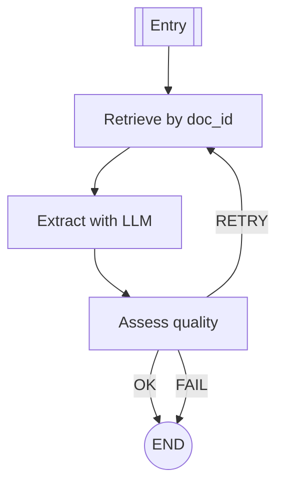

# RAG agent for document info

`build_extract_graph(vs, llm)`

Extracts 3 key fields: company legal name, financial year, and document type. Retrieval is scoped by `doc_id` for high precision.

Diagram — Extract graph

Show graph

- On retrieval miss (no docs), the graph returns an empty `DocInfo` without calling the LLM.
- LLM responses are validated; low-confidence routes to retry up to `max_attempts`.
